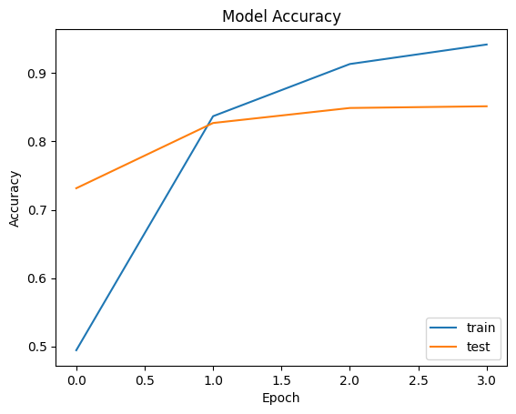
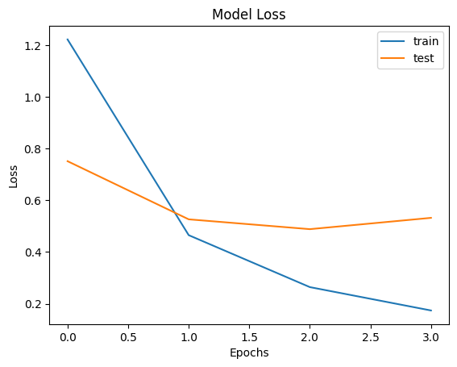

# Machine Learning Terapan
## Proyek Pertama
### Sentimen Analysis

### Disusun oleh : M. Rivqi Al Varras

Proyek ini adalah proyek pertama analisis prediktif untuk memenuhi submission Dicoding Kelas Machine Learning Terapan.

Proyek ini membangun model machine learning yang dapat memprediksi sentimen yang dilakukan oleh seseorang.

### Project Domain
##### Latarbelakang
Analisis  Sentimen(atau  dikenal dengan   penambangan   opini)   merujuk   kepada   penerapan pemrosesan  bahasa  alami,  linguistic  komputasi  dan  analisis teks  untuk  mengidentifikasi  dan  mengklasifikasikan  pendapat subjektif  dalam  sumber  materi.  Analisis  sentimen  bertujuan untuk  menentukan  sikap terhadap  beberapa  topik  maupun polaritas kontekstual keseluruhan dari sebuah dokumen. Secara general,   analisis   sentimen   mengklasifikasikan   teks   dalam sumber materi menjadi dua jenis : (1) fakta (objektif) : ekspresi objektfi mengenai  entitas, peristiwa  dan atribut; dan (2) opini (subyektif)  :  ekspresi  subyektif  dari  sentimen,  sikap,  emosi, penilaian atau perasaan terhadap entitas, peristiwa  dan atribut.
Twitter  merupakan  media  sosial  gratis  yang digunakan  masyarakat  luas  sebagai  alat  bagi  pengguna  untuk berbagi  informasi  pada  linimasa  secara real-time dengan cara    menambahkan    komentar    terkait    pengalaman    dan pemikiran  mereka.  Pesan  public  yang  dikirim  dan  diterima melalui twitter atau dikenal dengan ‘tweet’dibatasi tidak lebih dari  140  karakter  serta  dapat  menyertakan  tautan  ke  blog, halaman web, gambar, video serta media lainnya. Sebagai alat komunikasi,  Twitter  memungkinkan  pertukaran  ide  secara bebas  secara  nasional  dan  global,  antara  orang-orang  yang tertarik  pada  bidang  keahlian  yang  serupa,  serta  memberikan kesempatan untuk terlibat dalam debat kritis.[1]

Secara umum sentimen dapat dikategorikan sebagai postive dan negative atau indikator yang lebih spesifik, sebagai contoh anger, fear, joy, love, sadness, dan surprise atau indikator lain.

Dengan indikator diatas, sebuah tugas untuk menganalisa sentimen ini dapat di interpretasikan sebagai tugas klasifikasi dimana tiap kategori menyatakan sebuah sentimen. Analisa Sentimen ini berguna bagi perusahaan atau pemiliki usaha sebagai tolak ukur untuk mengukur seberapa diterimanya produk yang diberikan dan menentukan strategi untuk meningkatkan kualitas dari produk.

### Business Understanding
##### Problem Statements
1. Bagaimana cara melakukan pra-pemrosesan data agar dapat digunakan untuk melatih model?
2. Bagaiman cara membuat arsitektur model yang akan digunakan untuk memprediksi?
##### Goals
1. Melakukan pre-pemrosesan data dengan baik agar dapat digunakan membuat model
2. Mengetahui cara membuat model LSTM untuk memprediksi sentimen yang diberikan oleh individu

##### Solution Statements
Mengembangkan sebuah algoritma yang dapat memprediksi kategori dari sentimen yang diberikan oleh individu. Algoritma ini menggunakan pendekatan Deep Learning dengan melatih dan menguji modelnya menggunakan dataset berisi 20.000 data teks. Model yang dipilih yaitu **LSTM (Long Short-Term Memory)**.
LSTM merupakan modifikasi dari RNN yang memiliki memory dan banyak jenis gerbang yaitu input gate, forget gate, dan output gate. LSTM mampu mempelajari lebih dari 1000 langkah sebelumnya tergantung pada kompleksitas jaringan.

*Gambar 1 Kompleksitas jaringan LSTM*

Konsep inti dari LSTM adalah cell state dan 4 gates pada LSTM. Cell state merupakan alat yang berfungsi membawa informasi penting yang sudah melalui seluruh gates pada 1 cell LSTM menuju cell berikutnya. Komponen yang terdapat pada LSTM:
1. Forget gate memutuskan informasi mana yang akan disimpan ataupun di buang. Forget gate akan menerima informasi yang berupa hidden state yang berasal dari cell sebelumnya dan informasi baru yang berasal dari input saat ini, kemudiana informasi tersebut akan di gabung dan diproses dengan menggunakan fungsi sigmoid yang akan menghasilkan hasil berupa 0 hingga 1. Semakin dekat hasil yang diperoleh dengan 0 maka berarti informasi akan di buang, sebaliknya semakin dekata dengan 1 maka informasi akan disimpan.

*Gambar 2 Forgat gate*
2. Input gate akan menerima informasi yang berupa hidden state yang berasal dari cell sebelumnya dan informasi baru yang berasal dari input saat ini, kemudian informasi tersebut akan di gabung dan diproses dengan menggunakan fungsi sigmoid dan fungsi tanh. Hasil dari fungsi sigmoid akan mengubah nilai menjadi 0 hingga 1 untuk menentukan informasi mana yang akan di update. Semakin dekat dengan 0 berarti informasi tidak penting, semakin dekat denan 1 berarti informasi penting. Hasil dari fungsi tanh berupa nilai -1 hingga 1 digunakan untuk mendukung agar cell dapat mempelajari informasi dengan lebih baik.

*Gambar 3 Inpu gate*
3. Output gate akan menentukan hidden state yang akan dikirim ke cell selanjutnya. Output gate akan menerima informasi yang berupa hidden state yang berasal dari cell sebelumnya dan informasi baru yang berasal dari input saat ini kemudian informasi akan digabung dan diproses dengan fungsi sigmoid. Cell state yang baru kemudian akan di proses melalui fungsi tanh. Hasil dari fungsi tanh akan dikalikan dengan hasil dari fungsi sigmoid untuk memeroleh informasi yang akan disimpan pada hidden state yang baru. Hidden state dan Cell state yang baru kemudian akan diteruskan ke cell selanjutnya.[2]
 
*Gambar 4 Output gate*
### Data Understanding

|     Jenis     	| Keterangan 	|
|:-------------:	|:----------:	|
|     Sumber    	|      [Emotions dataset for NEmotions dataset for NLP](https://www.kaggle.com/datasets/praveengovi/emotions-dataset-for-nlp)      	|
| Collaborators 	|          [PRAVEEN](https://www.kaggle.com/praveengovi)  	|
| Kategori      	|       Sosial     	|
| Jenis         	|       txt     	|
| Ukuran        	|          738kB  	|
| Lisensi       	|           [CC BY-SA 4.0](https://creativecommons.org/licenses/by-sa/4.0/) 	|
Dataset yang digunakan adalah [Emotions dataset for NEmotions dataset for NLP](https://www.kaggle.com/datasets/praveengovi/emotions-dataset-for-nlp)
Pada berkas [dataset](https://www.kaggle.com/datasets/praveengovi/emotions-dataset-for-nlp) berisi 3 berkas dengan jenis format .txt yaitu train.txt, test.txt, dan val.txt. Masing-masing berkas berisi 16000, 2000, 2000 teks dan label. Setiap berkas memiliki 2 kolom yang bertipe kategorikal.
| Kolom 	|                                      Penjelasan                                      	|
|:-----:	|:------------------------------------------------------------------------------------:	|
|  Text 	|              kalimat/sentimen/pendapat/kritik yang ditulis oleh individu             	|
| Label 	| perasaan yang dirasakan oleh individu(anger, fear, joy, love, sadness, dan surprise) 	|

### Data Preparation
     
##### Prepare Dataset

Pada proyek ini membaca dataset menggunakan import file yang mengkonfigurasi API kaggle berformat json(JavaScript Object Notation) yang digunakan untuk mengunduh dataset dalam bentuk zip. Setelah data terunduh menggunakan import zipfile yang digunakan untuk mengestrak semua file yang ada.
##### Reading Dataset
Pembacaan dataset menggunakan fungsi pandas dataframe `pd.read_csv('namafile.csv')`
*Tabel 1 Dataframe*
|   |                        text                       |  label  |
|---|:-------------------------------------------------:|:-------:|
| 0 |              i didnt feel humiliated              | sadness |
| 1 | i can go from feeling so hopeless to so damned... | sadness |
| 2 |  im grabbing a minute to post i feel greedy wrong |  anger  |
| 3 | i am ever feeling nostalgic about the fireplac... |   love  |
| 4 |                i am feeling grouchy               |  anger  |
##### Get Info From Dataset
Pengecekan informasi yang ada pada dataset menggunakan fungsi `shape()` untuk mendapatkan jumlah dataset dan fungsi `isnull()` untuk mengetahui apakah dalam dataset terdapat missing value.
*Tabel 2 Shape dataframe*
| Data  | Shape |
|-------|:-----:|
| Train | 16000 |
| Test  |  2000 |
| Val   |  2000 |
*Tabel 3 Missing value dataframe*
| Data  | Missing value |
|-------|:-------------:|
| Train |       0       |
| Test  |       0       |
| Val   |       0       |
Melihat informasi teks yang ada pada indeks kolom 20
1. train sample txt: i feel irritated and rejected without anyone doing anything or saying anything
2. test sample txt: im not sure the feeling of loss will ever go away but it may dull to a sweet feeling of nostalgia at what i shared in this life with my dad and the luck i had to have a dad for years
3. val sample txt: i just know to begin with i am going to feel shy about it
dari sampel teks yang ada menunjukkan bahwa teks masih sangat kotor(data belum bersih) sehingga harus dioalh dulu sebelum melakukan proses model development

#### Data Cleaning
Pembersihan data dilakukan dalam beberapa langkah yaitu:
1. `lower_text(text)`: Fungsi ini mengubah semua karakter dalam teks menjadi huruf kecil. Hal ini membantu agar tidak ada perbedaan antara huruf besar dan kecil dalam pengolahan teks.

2. `remove_number(text)`: Fungsi ini menghapus semua angka dari teks. Ini berguna jika angka tidak penting dalam analisis yang dilakukan.

3. `remove_punct(text)`: Fungsi ini menghapus tanda baca dari teks. Tanda baca seringkali tidak penting dalam analisis teks dan dapat dihapus untuk meningkatkan efisiensi pemrosesan.

4. `remove_stopwords(text)`: Fungsi ini menghapus kata-kata penghubung (stopwords) dari teks. Stopwords adalah kata-kata yang umumnya tidak memiliki makna penting dalam analisis teks dan bisa diabaikan.

5. `lemmatize_lower(text)`: Fungsi ini melakukan dua tugas sekaligus. Pertama, ia mengubah teks menjadi huruf kecil. Kedua, ia melakukan lemmatisasi kata-kata dalam teks. Lemmatisasi adalah proses mengubah kata-kata menjadi bentuk dasar atau bentuk kata yang sesuai dalam kamus (lemmat).

6. `clean_text(text)`: Fungsi ini menggabungkan semua langkah pembersihan teks yang telah dijelaskan sebelumnya dalam satu fungsi. Dengan memanggil fungsi ini, teks akan dibersihkan dari angka, tanda baca, kata-kata penghubung, dan kemudian dilemmatisasi.

##### Convert Label to Num
Label Encoding adalah proses mengonversi nilai-nilai kelas atau label kategorikal menjadi nilai numerik. Ini berguna dalam pembelajaran mesin karena banyak algoritma memerlukan input dalam bentuk angka.
Label Encoding digunakan untuk mengubah variabel kategorikal menjadi representasi numerik berdasarkan penomoran kategori secara berurutan, di mana setiap kategori diberi nilai numerik yang unik.[3]
Hasil Label Encoding menggunakan fungsi `LabelEncoder`:
*Tabel 4 Encoding label*
|   label  | Encoding |
|:--------:|:--------:|
|   anger  |     0    |
|   fear   |     1    |
|    joy   |     2    |
|   love   |     3    |
|  sadness |     4    |
| surpirse |     5    |

##### One Hot Encoding
Pada bagian ini mengubah variabel label yang semula terdiri dari satu kolom dengan enam kategori menjadi enam kolom terpisah, di mana setiap kolom hanya memiliki nilai 0 atau 1, yang menunjukkan keanggotaan kategori tertentu. Proses ini dikenal sebagai One Hot Encoding, dan akan memungkinkan mesin untuk dengan lebih baik memahami dan memproses label kategori. Dalam hal ini menggunakan fungsi `to_categorical` dari pustaka `keras.utils`. 
##### Tokenization
Pada tahap ini, akan digunakan Tokenizer dan pad_sequences dari library tensorflow.keras. Tujuannya adalah untuk melakukan tokenisasi, yaitu membuat kamus yang mengaitkan setiap kata dalam teks dengan sebuah indeks integer, serta mengubah teks menjadi urutan integer yang sesuai dengan kamus tersebut.

Langkah-langkah yang dilakukan adalah sebagai berikut:

1. **Tokenisasi**: Pertama, perlu dibuat kamus kata dari teks yang terdapat dalam DataFrame train. Ini dilakukan dengan menggunakan Tokenizer, di mana setiap kata dalam teks akan diwakili oleh sebuah indeks integer. Penting untuk menggunakan hanya DataFrame train untuk mencegah kebocoran informasi dari data uji atau validasi. Kamus ini dibuat dengan memanggil fungsi `tokenizer.fit_on_texts(X_train)`.

2. **Konversi ke Integer**: Setelah kamus terbentuk, teks dalam DataFrame train, test, dan val diubah menjadi urutan integer yang sesuai dengan kamus tersebut. Hal ini dilakukan dengan memanggil fungsi `tokenizer.texts_to_sequences(X_train)`, `tokenizer.texts_to_sequences(X_test)`, dan `tokenizer.texts_to_sequences(X_val)`.

3. **Penyesuaian Panjang**: Setelah tokenisasi, perlu dipastikan bahwa panjang teks dalam setiap DataFrame sama. Untuk itu, digunakan fungsi pad_sequences dari library tensorflow.keras. Panjang teks yang ditetapkan adalah 128, dan jika teks melebihi panjang ini, bagian belakangnya akan dipotong. Proses ini memastikan bahwa setiap sampel teks memiliki panjang yang seragam, yang diperlukan saat memasukkan data ke dalam model.

Dengan melakukan langkah-langkah ini, data teks telah siap untuk proses selanjutnya dalam pembuatan model. Proses tokenisasi memungkinkan model untuk memahami teks dalam bentuk numerik, sedangkan penyesuaian panjang memastikan bahwa setiap sampel memiliki format yang seragam untuk pelatihan model.
   
##### Model Development
Model **LSTM (Long Short-Term Memory)** digunakan untuk melakukan klasifikasi pada data teks. Berikut adalah penjelasan teknis langkah-langkahnya:

1. **Impor Layer dan Model**: Mengimpor semua layer dan model yang diperlukan dari modul `tensorflow.keras`.

2. **Pembuatan Model**: Model dibuat sebagai objek `Sequential`. Pada model ini, terdapat beberapa lapisan:

   - **Embedding Layer**: Menggunakan lapisan embedding untuk mengkonversi input teks menjadi representasi vektor numerik. `vocab_size` adalah ukuran kamus (jumlah kata unik dalam teks), dan `64` adalah dimensi vektor yang diinginkan untuk representasi embedding. `input_length` menunjukkan panjang setiap sampel teks.
   
   - **Dropout Layer**: Layer dropout dengan parameter `0.4` digunakan untuk mencegah overfitting dengan secara acak mengabaikan 40% input unit selama pelatihan.
   
   - **Bidirectional LSTM Layers**: Dua lapisan LSTM bidirectional digunakan untuk mempelajari pola urutan dalam teks dari kedua arah. Lapisan pertama memiliki 128 unit LSTM dan mengembalikan urutan penuh (`return_sequences=True`), sedangkan lapisan kedua memiliki 256 unit LSTM.
   
   - **Dense Layer**: Lapisan Dense dengan 6 unit dan aktivasi softmax digunakan sebagai output layer untuk melakukan klasifikasi multikelas (6 kategori sentimen).

3. **Definisi Callback**: Didefinisikan sebuah kelas `myCallback` yang merupakan turunan dari `tf.keras.callbacks.Callback`. Fungsi `on_epoch_end` di dalamnya akan dipanggil pada akhir setiap epoch. Callback ini akan memberhentikan pelatihan jika akurasi pelatihan mencapai di atas 90% dan akurasi validasi mencapai di atas 85%.

4. **Kompilasi Model**: Model dikompilasi dengan pengoptimal Adam dengan laju pembelajaran 0.001. Sebagai fungsi kerugian, digunakan categorical crossentropy karena ini adalah masalah klasifikasi multikelas. Metrik yang dipantau adalah akurasi.

5. **Pelatihan Model**: Model dilatih dengan memanggil metode `fit` pada objek model. Data pelatihan (`X_train`) dan label yang telah dienkoding (`dmy_y_train`) digunakan untuk melatih model. Validasi dilakukan menggunakan data uji (`X_test`) dan label yang telah dienkoding (`dmy_y_test`). Pelatihan dilakukan selama 200 epoch dengan ukuran batch 128. Callback `myCallback` yang telah didefinisikan sebelumnya juga digunakan di sini.

#### Evaluation
Dalam proyek ini, digunakan model deep learning bertipe classification. Klasifikasi yang baik diindikasikan oleh tingkat akurasi mendekati 100%, sementara performa yang buruk terlihat saat akurasi turun di bawah 75%. Metrik yang digunakan untuk mengevaluasi kinerja model adalah Accuracy. Metrik ini menghitung jumlah prediksi yang benar dibagi dengan total prediksi yang dilakukan.

Selain Accuracy, juga digunakan metrik seperti presisi (precision), recall, dan f1-score. Presisi mengukur seberapa andalnya model dalam memberikan prediksi untuk kelas tertentu. Recall, di sisi lain, mengukur kemampuan model untuk memprediksi kelas True Positive dengan baik. F1-Score mencari titik seimbang antara presisi dan recall, sehingga memberikan gambaran keseluruhan tentang kinerja model.

Untuk menghitung metrik ini, digunakan fungsi classification_report yang disediakan oleh library sklearn. Setiap metrik memiliki definisi yang spesifik:

- Presisi (precision) dihitung sebagai jumlah True Positive dibagi dengan jumlah True Positive ditambah False Positive.

- Recall dihitung sebagai jumlah True Positive dibagi dengan jumlah True Positive ditambah False Negative.
- F1-Score adalah rata-rata tertimbang dari presisi dan recall, dengan nilai maksimum 1 yang menunjukkan kinerja yang sempurna.

Dengan menggunakan TP (True Positive), TN (True Negative), FP (False Positive), dan FN (False Negative), dapat memperoleh gambaran yang akurat tentang kinerja model dalam melakukan klasifikasi.

*Gambar 5 Accuracy Model*

*Gambar 6 Loss Model*

*Tabel 5 Evaluasi model*
|          | precision | recall | f1-score | support |
|:--------:|:---------:|:------:|:--------:|:-------:|
|   anger  |    0.86   |  0.76  |   0.81   |   275   |
|   fear   |    0.85   |  0.74  |   0.79   |   224   |
|    joy   |    0.86   |  0.90  |   0.88   |   695   |
|   love   |    0.69   |  0.73  |   0.71   |   159   |
|  sadness |    0.87   |  0.88  |   0.88   |   581   |
| surpirse |    0.61   |  0.74  |   0.67   |    66   |

|   accuracy   	|      	|      	| 0.84 	| 2000 	|
|:------------:	|:----:	|:----:	|:----:	|:----:	|
|   macro avg  	| 0.79 	| 0.79 	| 0.79 	| 2000 	|
| weighted avg 	| 0.84 	| 0.84 	| 0.84 	| 2000 	|
Kesimpulan dari evaluasi menunjukkan bahwa model berhasil mencapai performa yang tinggi saat dilatih, dengan akurasi mencapai 94% dan validasi sebesar 85%. Kinerja yang baik ini juga terkonfirmasi melalui evaluasi model menggunakan data uji yang telah disiapkan. Dari hasil evaluasi data uji, dapat dibuat laporan klasifikasi dalam tabel 5. Dari tabel 5, kita dapat melihat skor model terhadap tiga metrik yang dihasilkan oleh laporan klasifikasi. Dari hasil ini, dapat disimpulkan bahwa model yang dikembangkan telah cocok dengan baik (Good Fit)
#### Reference

[1] [Savitri, N. L. P. C., Rahman, R. A., Venyutzky, R. and Rakhmawati, N. A. (2021) “Analisis Klasifikasi Sentimen Terhadap Sekolah Daring pada Twitter Menggunakan Supervised Machine Learning”, Jurnal Teknik Informatika dan Sistem Informasi. Jakarta, Indonesia, 7(1). doi: 10.28932/jutisi.v7i1.3216.](http://114.7.153.31/index.php/jutisi/article/view/3216/1837)

[2][Gallan, V. (2023) LSTM (long short term memory), Medium. Available at: https://medium.com/bina-nusantara-it-division/lstm-long-short-term-memory-d29779e2ebf8 (Accessed: 22 February 2024). ](https://medium.com/bina-nusantara-it-division/lstm-long-short-term-memory-d29779e2ebf8)

[3] [Ihwan, A. (2023) Bahasa Python - feature engineering ‘encoding’, LinkedIn. Available at: https://www.linkedin.com/pulse/bahasa-python-feature-engineering-encoding-aris-ihwan/?originalSubdomain=id (Accessed: 22 February 2024).](https://www.linkedin.com/pulse/bahasa-python-feature-engineering-encoding-aris-ihwan/?originalSubdomain=id) 
