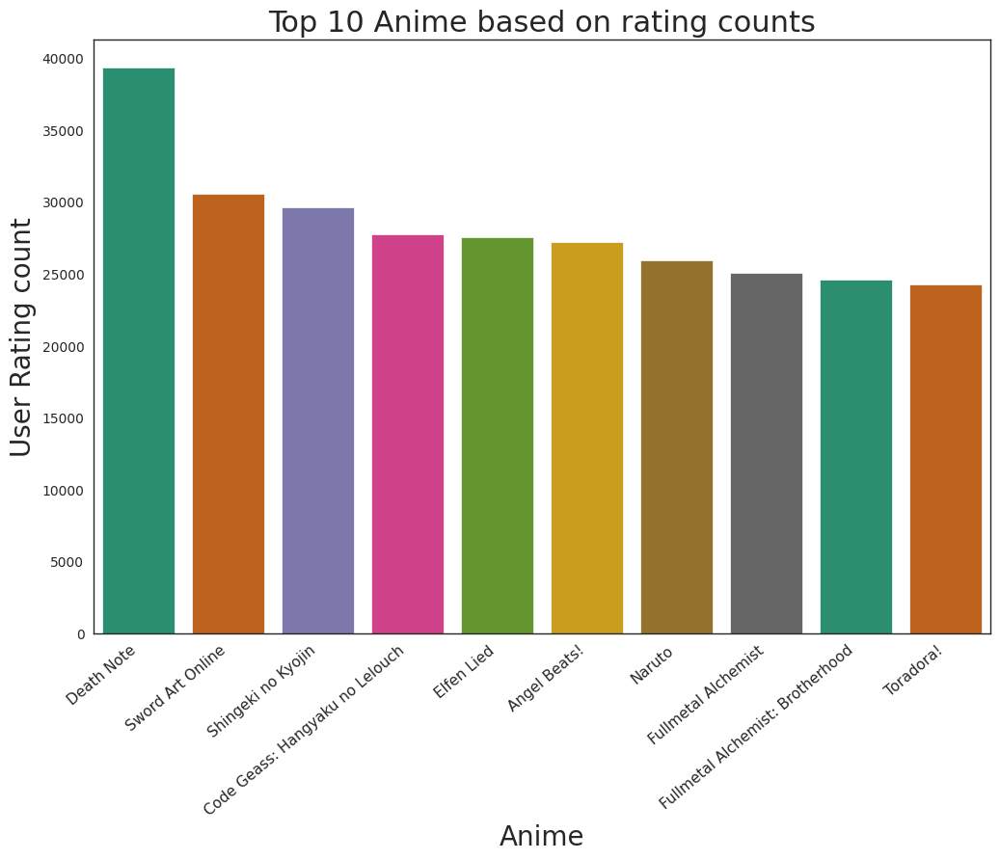
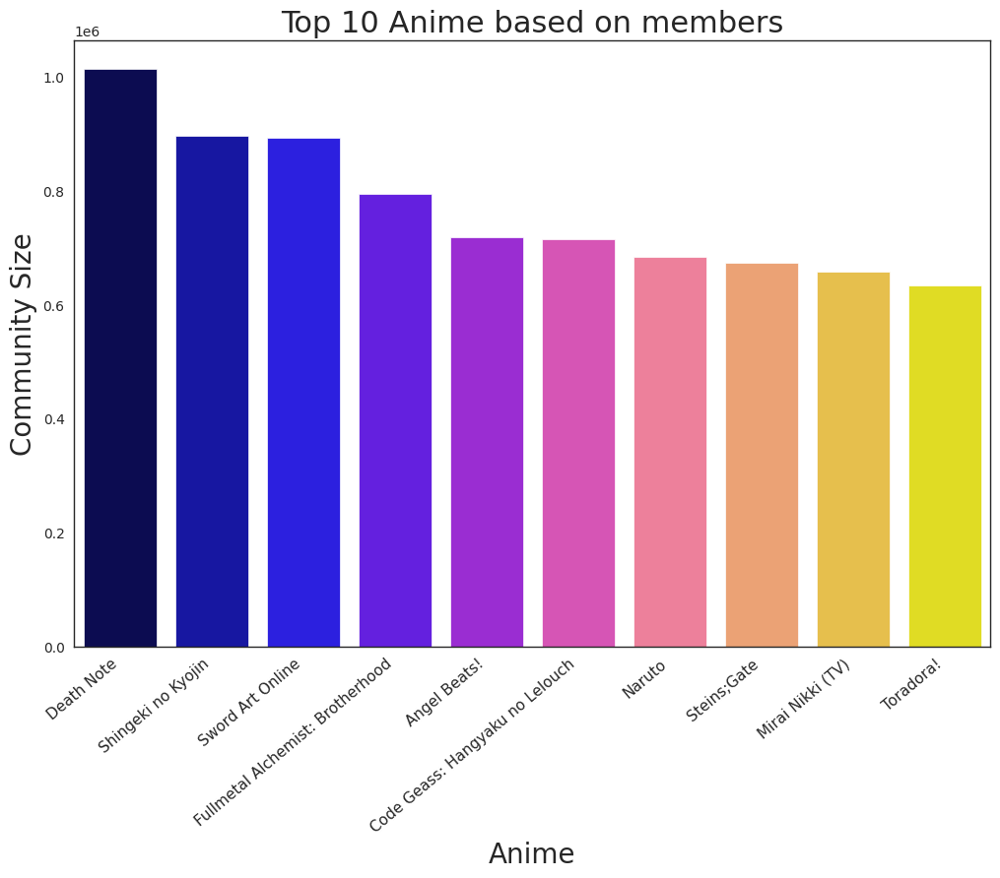
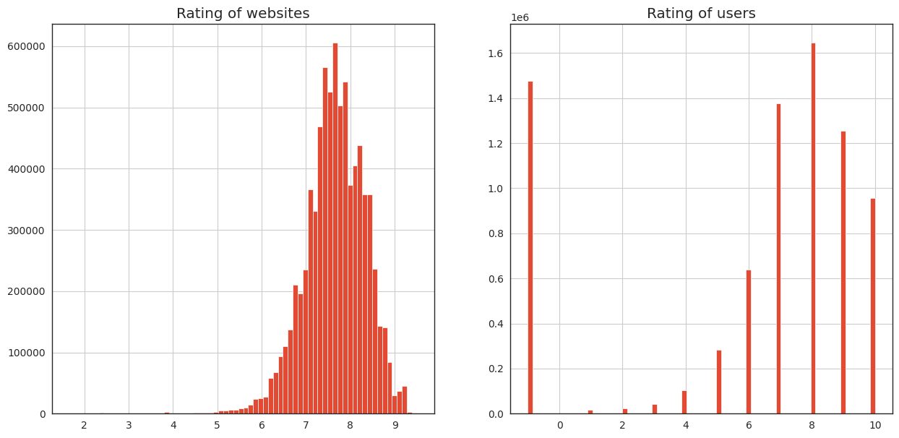
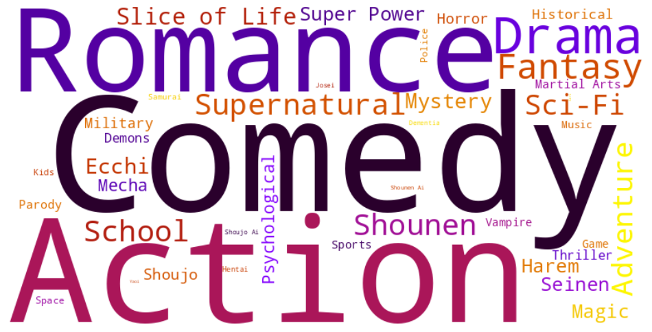
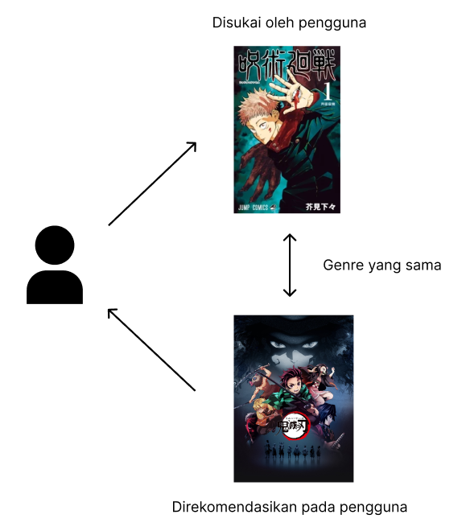
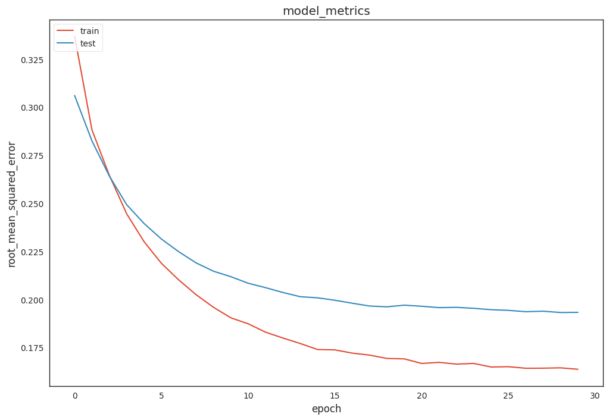

# Machine Learning Terapan

## Anime Recomendations

###### Disusun oleh : M. Rivqi Al Varras

## Project Overview
Pada  masa  pandemi  Covid  19  ,  pemerintah  menganjurkan  kepada  masyarakat untuk menghindari kerumunan demi mencegah penyebaran Covid 19. Hal ini juga berdampak pada kegiatan jual beli yang mengharuskan dilakukan secara online apabila memungkinkan. Berdasarkan  survei  yang telah dilakukan oleh  BI  (Bank  Indonesia)yang  mendapatkan  500 responden  berasal  dari  pulau  Jawa,  kegiatan  belanja  online  memiliki  presentasi  14%, sedangkan  belanja  secara  offline memiliki  presentase  sebanyak24%  semenjak terjadinya pandemi COVID-19.  Sebelum adanya pandemi,  responden  yang  berasal  dari  pulau  jawa mengatakan  bahwa mereka lebih  memilih  belanja  secara  offline  dibandingkan  online yang dimana memiliki presentase sebanyak 72%. Pembelian tidak hanya dilakukan untuk membeli barang-barang  kebutuhan  pokok  saja  tetapi  juga  untuk  memenuhi  gaya  hidup  dan  untuk memenuhi hasratnya. Pembelian yang dilakukan semata-mata untuk memenuhi hasrat dan berdasarkan emosi untuk membeli barang-barang tanpa memperhitungan bagaimana nilainya biasa  disebut dengan  perilaku  konsumtif.Dengan  didukung  kemudahan  masyarakat  dalam melakukan  jual  beli  secara  online  melalui  aplikasi  dan  web,  maka  membuat  masyarakat semakin gemar melakukan perilaku konsumtif. Menurut Sumartono (dalam Damasta & Dewi, 2020)perilaku konsumtif adalah perilaku membeli  tanpa  memerhitungkan  manfaat  dan  untuk  kesenangan  semata.  Dengan  adanya COVID-19   kegiatan   yang   dapat   dilakukan   pun   menjadi   terbatas   alhasil   orang-orang melakukan  perilaku  konsumtif  untuk  menghabiskan  waktu.  Menurut  Sumartono (dalam Damasta & Dewi, 2020)faktor yang memengaruhi perilaku konsumtif, yaitu faktor dari dalam diri dan faktor dari luar. Salah satu faktor selain 2 faktor tersebut yangdapatmemengaruhi perilaku  konsumtif  ialah  bentuk  kesukaan  yang  berlebihan  terhadap  suatu  hal  yang  bisa disebut  fanatisme.  Menurut  Chung (dalam  Damasta  &  Dewi,  2020),  fanatisme  merupakan bentuk  kecintaan  luar  biasa  terhadap  suatu  objek.  Salah  satunya  **fenomena  fanatisme terhadap  anime**.  Mereka  yang  fanatik  terhadap  anime  akan  membeli  barang-barang  yang mereka  sukai  tidak  peduli  dengan  harga  dan  nilai  dari  barang  tersebut.[1]

Berdasarkan permasalahan tersebut, pada proyek ini akan dibuat suatu model sistem rekomendasi menggunkaan _content-based filtering_ dan _collaborative filtering_ untuk merekomendasikan anime yang mungkin akan ditonton oleh seseorang.

_Content-based filtering_ merupakan metode yang digunakan untuk merekomendasikan item berdasarkan fitur dari item berdasarkan dari aksi atau explicit feedback sebelumnya.Sistem rekomendasi _content-based filtering_ merekomendasikan  item  yang  mirip  dengan  yang  disukai user   sebelumnya.   Nilai   kesamaan antar   item   dihitung berdasarkan  fitur  yang  ada  pada  setiap  konten.[2]

_Collaborative  filtering_ merupakan  metode  yang  merekomendasikan  sebuah  item yang    berdasarkan    pada    kemiripan    ketertarikan    antarpengguna.[3]

Dengan adanya sistem rekomendasi ini diharapkan dapat membantu seseorang dalam menentukan anime yang akan ditonton selanjutnya.

## Business Understanding
##### Problem Statements
Berdasarkan penjelasan pada project overview, berikut merupakan rincian masalah yang perlu diselesaikan di proyek ini:

1. Sistem rekomendasi apa yang baik diterapkan pada kasus ini?
2. Bagaimana cara membuat sistem rekomendasi anime yang akan merekomendasikan anime berdasarkan jenis atau genre dari anime?
3. Bagaimana cara membuat sistem rekomendasi anime yang akan merekomendasikan anime berdasarkan kemiripan ketertarikan antarpengguna dari anime?
4. Bagaimana meningkatkan penjualan anime berdasarkan rating?
5. Bagaimana meningkatkan kualitas anime berdasarkan rating?

##### Goals
Tujuan dibuatnya proyek ini adalah sebagai berikut:

1. Membuat sistem rekomendasi anime berdasarkan jenis atau genre.
2. Membuat sistem rekomendasi anime berdasarkan kemiripan ketertarikan antarpengguna
3. Memberikan rekomendasi anime yang mungkin disukai pengguna.
4. Meningkatkan penjualan Anime
5. Meningkatkan keterlibatan pengguna terhadap kualitas dari anime

##### Solution Approach
Solusi yang dapat dilakukan untuk memenuhi tujuan dari proyek ini diantaranya:

1. Membuat sebuah model sistem rekomendasi menggunakan algoritma _Collaborative  filtering_
2. Membuat sebuah model sistem rekomendasi menggunakan algoritma _Content-based filtering_ 
3. Mengevaluasi hasil rekomendasi yang diberikan

## Data Understanding

*Tabel 1 Penjelasan dataset* 
|     **Jenis**     	|                                                  **Keterangan**                                                  	|
|:-------------:	|:------------------------------------------------------------------------------------------------------------:	|
|     Sumber    	| [Anime Recommendations Database](https://www.kaggle.com/datasets/CooperUnion/anime-recommendations-database) 	|
| Collaborators 	|                                               Basement Dweller                                               	|
|    Kategori   	|                                                    Sosial                                                    	|
|     Jenis     	|                                                      csv                                                     	|
|     Ukuran    	|                                                     112.34 MB                                                    	|
|    Lisensi    	|                                              CC0: Public Domain                                              	|

Dataset yang digunakan adalah [Anime Recommendations Database](https://www.kaggle.com/datasets/CooperUnion/anime-recommendations-database).
Pada berkas [dataset](https://www.kaggle.com/datasets/CooperUnion/anime-recommendations-database) berisi 2 berkas dengan jenis format .csv yaitu anime.csv dan rating.csv.

*Tabel 2 Penjelasan file anime.csv*
| **Kolom** 	|                                       **Penjelasan**                                      	| **Tipe data** 	|
|:---------:	|:-----------------------------------------------------------------------------------------:	|:-------------:	|
|  anime_id 	|                                    ID unik dari anime                                     	|     int64     	|
|    name   	|                                     Nama lengkap anime                                    	|     object    	|
|   genre   	|                                     Daftar genre anime                                    	|     object    	|
|    type   	|               Jenis anime, misalnya film (movie), serial TV (TV), OVA, dll.               	|     object    	|
|  episodes 	|                                 Jumlah episode dalam anime                                	|     object    	|
|   rating  	| Nilai rata-rata dari 10 untuk anime ini, yang mencerminkan penilaian komunitas(penonton). 	|    float64    	|
|  members  	|                  Jumlah anggota komunitas yang tergabung dalam grup anime                 	|     int64     	|

*Tabel 3 Penjelasan file rating.csv*
| **Kolom** 	|                                                                          **Penjelasan**                                                                         	| **Tipe data** 	|
|:---------:	|:---------------------------------------------------------------------------------------------------------------------------------------------------------------:	|:-------------:	|
|  anime_id 	|                                                           ID anime yang dinilai oleh pengguna tersebut                                                          	|     int64     	|
|  user_id  	|                                              ID pengguna yang dihasilkan secara acak dan tidak dapat diidentifikasi                                             	|     int64     	|
|   rating  	| Nilai yang diberikan oleh pengguna untuk anime tersebut dalam skala 1 hingga 10. Jika pengguna menonton anime tetapi tidak memberikan penilaian, nilai akan -1. 	|     int64     	|

**Exploratory data analysis**
1. Anime teratas berdasarkan rating penonton

    
    *Gambar 1 Anime teratas berdasarkan rating penonton*

    Berdasarkan penilaian penonton, _Death Note_ menempati peringkat teratas sebagai anime favorit yang paling banyak ditonton, diikuti oleh _Sword Art Online_ dan _Code Geass_.
2. Anime teratas berdasarkan Komunitas

    
    *Gambar 2 Anime teratas berdasarkan Komunitas*

    Berdasarkan penilaian penonton, _Death Note_ menempati peringkat teratas sebagai anime favorit yang paling banyak komunitasnya, diikuti oleh _Shingeki no kyojin_ dan _Sword Art Online_.

3. Distribusi rating

    
    *Gambar 3 Distribusi Rating*

    Berdasarkan penilaian penonton menunjukkan bahwa anime mengalami tren positif, dilihat dari penonton yang banyak menilai berkisar antara 7,6-7,8 pada website

4. Distribusi genre

    
    *Gambar 4 Distribusi genre*

    Berdasarkan _word cloud_ menunjukkan genre yang paling banyak atau dominan adalah _Comedy_ dan _Action_, diikuti oleh genre _Romance_,Drama, dan _Fantasy_.

## Data Preparation
Langkah langkah pra_pemrosesan data:
1. Membaca dataset menggunakan pandas

    Pembacaan dataset menggunakan library pandas dengan _function_   `pd.read_csv()`

2. Penggabungkan kedua file

    Menggabungkan file anime.csv dan rating.csv menggunakan _function_  `pd.merge()` 

3. _Handling missing value (NaN)_

    Membuang _missing value_ menggunakan _function_ `repalce ()`
4. _Filtering user_id_

    Membuang nilai duplikat yang ada pada kolom user_id, dalam gambar 3 terlihat terdapat beberapa duplikat niali pada kolom user_id yang bernilai 1 sebanyak 5.

5. _Pivot_

    _pivot tabel_ adalah cara yang berguna untuk merangkum dan meringkas data yang kompleks. Dengan menggunakan _pivot tabel_ dapat mengubah susunan data menjadi bentuk yang lebih mudah dipahami dan menganalisis. Biasanya, _pivot tabel_ digunakan untuk melakukan aggregasi data, seperti menghitung rata-rata, jumlah, atau nilai lainnya dari suatu kolom data berdasarkan kelompok tertentu. _Pivot tabel_ struktur umum yang digunakan untuk membuat matriks _sparse_ (sparse matrix) 
     
6. _Cleaning anime_title_

    Menghilangkan karakter karakter khsusus pada kolom anime_title

7. TF-IDF 
    TF-IDF merupakan singkatan dari _Term Frequency — Inverse Document Frequency_. Sejatinya, TF-IDF merupakan gabungan dari 2 proses yaitu _Term Frequency_ (TF) dan _Inverse Document Frequency_ (IDF).

    TF-IDF biasa digunakan ketika kita ingin mengubah data teks menjadi vektor namun dengan memperhatikan apakah sebuah kata tersebut cukup informatif atau tidak. Mudahnya, TF-IDF membuat kata yang sering muncul memiliki nilai yang cenderung kecil, sedangkan untuk kata yang semakin jarang muncul akan memiliki nilai yang cenderung besar. Kata yang sering muncul disebut juga Stopwords biasanya dianggap kurang penting, salah satu contohnya adalah kata hubung (yang, di, akan, dengan, dll).

    
    1. _Term Frequency_ (TF)
    _Term Frequency_ (TF) menghitung frekuensi jumlah kemunculan kata pada sebuah dokumen. Karena panjang dari setiap dokumen bisa berbeda-beda, maka umumnya nilai TF ini dibagi dengan panjang dokumen (jumlah seluruh kata pada dokumen).

    $$ \text{tf}_{t,d} = \frac{\text{tf}_{t,d}}{\text{Total number of terms in document}} $$

    2. _Inverse Document Frequency_ (IDF)

    _Inverse Document Frequency_ (IDF) merupakan nilai untuk mengukur seberapa penting sebuah kata. IDF akan menilai kata yang sering muncul sebagai kata yang kurang penting berdasarkan kemunculan kata tersebut pada seluruh dokumen. Semakin kecil nilai IDF maka akan dianggap semakin tidak penting kata tersebut, begitu pula sebaliknya.[4]

    $$ idfd = \log \left( \frac{\text{Number of document}}{\text{Number of document with term } t'} \right) $$
  

## Modelling

#### Collaborative Filtering
Sistem yang dibangun oleh proyek ini adalah sistem rekomendasi sederhana berdasarkan rating penonton anime berbasis _collaborative filtering_.

Sistem rekomendasi berbasis rating adalah sistem yang merekomendasikan konten yang mirip dengan konten yang disukai pengguna sebelumnya. Apabila suatu konten memiliki karakteristik yang sama atau hampir sama dengan konten lainnya, maka kedua konten tersebut dapat dikatakan mirip.

Misalkan dalam sistem rekomendasi anime, jika pengguna menyukai anime Jujutsu Kaisen, sistem dapat merekomendasikan anime dengan genre action lainnya.

*Gambar 5 Collaborative Filtering*

Pendekatan ini mencoba untuk menemukan pola kolaboratif antara pengguna dan item yang direkomendasikan berdasarkan interaksi atau preferensi mereka.

Ada dua jenis utama dalam Collaborative Filtering:

1. User-Based Collaborative Filtering: Pendekatan ini mencari kesamaan antara pengguna berdasarkan riwayat preferensi atau interaksi mereka dengan item. Jika dua pengguna memiliki pola preferensi yang serupa, kemungkinan besar mereka akan memiliki preferensi yang sama pada item yang belum mereka eksplorasi. Rekomendasi diberikan berdasarkan preferensi pengguna yang serupa.

2. Item-Based Collaborative Filtering: Pendekatan ini mencari kesamaan antara item berdasarkan riwayat preferensi atau interaksi pengguna dengan item tersebut. Jika dua item memiliki pola preferensi yang serupa dari pengguna yang sama, kemungkinan besar pengguna yang memiliki preferensi pada item pertama juga akan memiliki preferensi pada item kedua. Rekomendasi diberikan berdasarkan kesamaan antara item yang ada dengan item yang diminati oleh pengguna.

Kelebihan Collaborative Filtering:

1. Discovery of Serendipity: Collaborative Filtering dapat menghasilkan rekomendasi yang tidak terduga atau serendipitous. Pendekatan ini memungkinkan pengguna menemukan item baru yang mungkin tidak mereka eksplorasi sebelumnya.
2. Tidak tergantung pada fitur konten: Pendekatan ini tidak memerlukan informasi tentang fitur konten dari item yang direkomendasikan. Ini membuatnya berguna dalam situasi di mana informasi fitur tidak tersedia atau sulit untuk dianalisis.

Kekurangan Collaborative Filtering:

1. Cold Start Problem: Collaborative Filtering memiliki tantangan saat menghadapi pengguna baru atau item baru. Jika tidak ada riwayat preferensi atau interaksi yang tersedia, sulit untuk memberikan rekomendasi yang relevan.
2. Scalability: Pendekatan ini dapat mengalami kesulitan dalam skala yang besar. Semakin banyak pengguna dan item yang ada, semakin sulit untuk menghasilkan rekomendasi yang akurat secara efisien.
3. Pendekatan Collaborative Filtering memanfaatkan informasi dari pengguna-pengguna lain untuk memberikan rekomendasi.

Dalam praktiknya, seringkali pendekatan ini dikombinasikan dengan Content-Based Filtering untuk meningkatkan performa dan relevansi rekomendasi yang dihasilkan.

##### Training Model
Pada tahapan training model, proses yang dilakukan adalah sebagai berikut:

1. Splitting Data: Bagi data menjadi set pelatihan (train set) dan set pengujian (test set). Set pelatihan akan digunakan untuk melatih model, sedangkan set pengujian akan digunakan untuk menguji performa model secara independen. Perbandingan umum adalah sekitar 80% data untuk set pelatihan dan 20% untuk set pengujian.

2. Model Architecture: Tentukan arsitektur model RecommenderNet yang akan digunakan. RecommenderNet adalah model yang dirancang khusus untuk tugas rekomendasi dan memanfaatkan teknik deep learning untuk menghasilkan rekomendasi yang personal dan akurat. Arsitektur model RecommenderNet harus disesuaikan dengan masalah spesifik dan karakteristik data.

3. Data Preparation for Training: Lakukan pra-pemrosesan pada data pelatihan. Ini melibatkan konversi variabel kategori menjadi representasi numerik yang sesuai, normalisasi data jika diperlukan, dan pembuatan data dalam bentuk yang cocok untuk pelatihan model RecommenderNet.

4. Training Model: Latih model RecommenderNet menggunakan set pelatihan. Selama proses pelatihan, model akan mempelajari pola-pola dan relasi antara pengguna dan kursus untuk menghasilkan rekomendasi yang tepat. Proses ini melibatkan optimisasi parameter melalui iterasi berulang untuk mengurangi kesalahan dan meningkatkan kinerja model.

5. Evaluasi Model: Evaluasi performa model menggunakan set pengujian yang telah dipisahkan sebelumnya. Hitung metrik evaluasi yang sesuai, seperti akurasi, presisi, atau recall, untuk mengukur sejauh mana model mampu memberikan rekomendasi yang relevan dan sesuai dengan preferensi pengguna.

Dalam tahapan ini, data dipisahkan menjadi set pelatihan dan set pengujian untuk memastikan evaluasi yang objektif terhadap performa model.

Set pelatihan digunakan untuk melatih model, sedangkan set pengujian digunakan untuk menguji performa model secara independen dan mengukur sejauh mana model dapat menggeneralisasi dengan baik ke data yang belum pernah dilihat sebelumnya.

Berikut 10  hasil rekomendasi Anime untuk pengguna dengan user_id  357

*Tabel 4 Hasil rekomendasi algoritma Collaborative Filtering*
|             Anime            	|                                     Genre                                    	|
|:----------------------------:	|:----------------------------------------------------------------------------:	|
|           Mushishi           	| Adventure, Fantasy, Historical, Mystery, Seinen, Slice of Life, Supernatural 	|
|     Shoujo Kakumei Utena     	|                     Drama, Fantasy, Psychological, Shoujo                    	|
|      Chibi Maruko-chan       	|                         Comedy, Shoujo, Slice of Life                        	|
|     Howl no Ugoku Shiro      	|                      Adventure, Drama, Fantasy, Romance                      	|
| Abenobashi Mahou☆Shoutengai  	|                        Comedy, Ecchi, Fantasy, Parody                        	|
|  Iria: Zeiram The Animation  	|                       Action, Adventure, Sci-Fi, Space                       	|
|         Perfect Blue         	|                     Dementia, Drama, Horror, Psychological                   	|
|     Maria-sama ga Miteru     	|                   Drama, Romance, School, Shoujo, Shoujo Ai                  	|
|     Mirai Shounen Conan      	|                           Adventure, Drama, Sci-Fi                           	|
|         Black Lagoon         	|                                Action, Seinen                                	|

#### Content Based Filtering

*Gambar 6 Content Based Filtering*

_Content-based filtering_, atau yang juga disebut sebagai _cognitive filtering_, merekomendasikan item berdasarkan perbandingan antara konten dari item tersebut dan profil pengguna. Konten dari setiap item direpresentasikan sebagai kumpulan deskriptor atau istilah, biasanya kata-kata yang muncul dalam sebuah dokumen. Sebuah sistem rekomendasi berbasis konten bekerja dengan data yang diberikan oleh pengguna, baik secara eksplisit (penilaian) maupun secara implisit (mengklik tautan). Berdasarkan data tersebut, sebuah profil pengguna dibuat, yang kemudian digunakan untuk memberikan saran kepada pengguna. Saat pengguna memberikan lebih banyak masukan atau mengambil tindakan atas rekomendasi-rekomendasi tersebut, rekomendasi tersebut menjadi semakin akurat.

Content-Based Filtering adalah pendekatan dalam sistem rekomendasi yang mengandalkan analisis konten dari item yang direkomendasikan. Dalam konteks sistem rekomendasi anime, pendekatan ini akan menganalisis fitur-fitur konten dari anime dataset, seperti nama anime, genre, rating, atau member yang terkait, untuk memberikan rekomendasi yang relevan kepada penonton.

Kelebihan Content-Based Filtering:

1. Personalisasi: Pendekatan Content-Based Filtering memungkinkan personalisasi yang tinggi, karena rekomendasi didasarkan pada preferensi penonton yang diungkapkan melalui analisis nama anime.
2. Tidak tergantung pada data penonton lain: Pendekatan ini tidak memerlukan informasi tentang preferensi penonton lain, sehingga tidak bergantung pada data kolaboratif atau historis dari penonton lainnya.
3. Memperhitungkan kepentingan unik penonton: Pendekatan ini memperhitungkan preferensi penonton yang spesifik dan tidak terpengaruh oleh tren atau preferensi umum.

Kekurangan Content-Based Filtering:

1. Terbatas pada fitur yang diamati: Pendekatan ini terbatas pada fitur-fitur yang diamati dan dianalisis dalam konten anime. Rekomendasi mungkin kurang beragam jika tidak ada fitur yang signifikan dalam analisis konten yang dapat membedakan anime secara signifikan.
2. Tidak memperhitungkan preferensi baru: Pendekatan ini tidak secara otomatis menyesuaikan dengan perubahan preferensi penonton. Jika preferensi penonton berubah atau berkembang, rekomendasi mungkin tetap berfokus pada preferensi yang lebih lama.

##### Tahapan yang dilakukan dengan pendekatan Content-Based Filtering

Selama pendekatan ini, proses modeling dilakukan berdasar urutan sebagai berikut ini:

1. TF-IDF Vectorizer: Tahap ini melibatkan penggunaan TF-IDF (Term Frequency-Inverse Document Frequency) Vectorizer untuk mengubah teks pada nama anime menjadi representasi numerik. TF-IDF mengukur pentingnya suatu kata dalam dokumen berdasarkan frekuensi kemunculan kata tersebut dalam dokumen dan inversi frekuensi kemunculan kata tersebut dalam seluruh koleksi dokumen. TF-IDF Vectorizer menghasilkan vektor fitur yang merepresentasikan konten nama anime.
2. Fungsi sigmoid_kernel dari Scikit-learn menghitung kemiripan kernel sigmoid antara sampel dalam data yang diberikan.

    Kernel sigmoid adalah salah satu metode untuk mengukur kemiripan antara dua sampel dalam ruang fitur yang tinggi. Cara kerjanya adalah dengan menggunakan fungsi sigmoid untuk menghitung kemiripan antara dua vektor. Fungsi sigmoid memiliki bentuk matematis yang mirip dengan kurva S, di mana nilai input dipetakan ke rentang antara 0 dan 1.

    Secara matematis, kernel sigmoid antara dua vektor x dan y didefinisikan sebagai:

    $$K(x, y) = tanh(α * (x^T * y) + c)
    $$

    Nilai kernel sigmoid antara dua vektor akan berada dalam rentang 
    [
    −
    1
    ,
    1
    ]
    [−1,1], di mana nilai yang lebih tinggi menunjukkan kemiripan yang lebih besar antara dua vektor. Jika hasilnya mendekati 1, maka kedua vektor dianggap mirip, sedangkan jika mendekati -1, maka kedua vektor dianggap tidak mirip.

*Tabel 5 Hasil rekomendasi algoritma Content Based Filtering*
|                     Anime name                    	| Rating 	|
|:-------------------------------------------------:	|:------:	|
|               Dragon Ball Kai (2014)              	|  8.01  	|
|                  Dragon Ball Kai                  	|  7.95  	|
|       Dragon Ball Z Movie 15: Fukkatsu no F       	|  7.55  	|
|                 Dragon Ball Super                 	|  7.40  	|
|       Dragon Ball Z: Summer Vacation Special      	|  7.05  	|
|        Dragon Ball Z: Atsumare! Gokuu World       	|  6.76  	|
| Dragon Ball GT: Goku Gaiden! Yuuki no Akashi w... 	|  6.75  	|
| Dragon Ball Z Movie 11: Super Senshi Gekiha!! ... 	|  6.28  	|
|                    Dragon Ball                    	|  8.16  	|
|        Dragon Ball Z Movie 14: Kami to Kami       	|  7.62  	|

## Evaluation

1. Content Based Filtering

$$Precision = TP / (TP + FP)$$

$$Precision = TP / (TP + FP) = 10 / (10 + 0)= 1 = 100 $$

Evaluasi hasil sistem dengan recommender system precision dalam menemukan rekomendasi dari anime Death Note adalah sebesar 10/10 atau 100%.

2. Collaborative Filtering

MSE  atau  _Mean  Square  Error_  adalah  suatu  metode  untuk  menguji  tingkaterror  dari  suatu  metode peramalan.  MSE  dapat  digunakan  dalam  pengukuran kinerja prosedur suatu perbaikan citra.Pengukuran dengan MSE ini didapatkan nilai untuk membandingkan kinerja nilai hasil sebelum perbaikan citra dengan nilai sesudah citra mengalami perbaikan sesuai dengan yang diharapkan.[5]

*Gambar 7 Evaluasi model Collaborative Filtering*

Pada gambar diatas, model nilai RMSE terus bergerak turun dari 0.3370 untuk latih dan 0.3062 untuk validasi hingga hingga mendapatkan hasil akhir yaitu  0.1637 untuk latih dan 0.1933 untuk validasi.

Berdasarkan hasil tersebut di atas, maka dapat dikatakan bahwa model ini menjadi model yang optimal.

## Conclusion

Proyek ini berhasil mengembangkan sebuah sistem rekomendasi yang dapat memberikan pengalaman pengguna yang lebih baik dalam mencari dan memilih Anime.

Dengan menerapkan pendekatan Content-Based Filtering dan Collaborative Filtering, sistem dapat memberikan rekomendasi Anime yang personal dan relevan berdasarkan preferensi pengguna. Melalui penggunaan metrik evaluasi yang relevan seperti Precission dan Root Mean Square Error (RMSE), keberhasilan sistem akan dapat diukur dalam mencapai tujuan yang telah ditetapkan. Evaluasi terhadap pendekatan Content-Based Filtering menggunakan metrik Precission, sedangkan pendekatan Collaborative Filtering dievaluasi menggunakan metrik RMSE.

Dengan memberikan rekomendasi kursus yang relevan dan menarik, proyek ini berpotensi meningkatkan retensi pengguna pada layanan streaming Anime. Rekomendasi yang disesuaikan dengan preferensi pengguna akan membantu pengguna dalam menemukan Anime yang paling sesuai dengan minat mereka.
Selain itu, sistem rekomendasi ini juga dapat memberikan manfaat bagi platform layanan streaming Anime dalam mengoptimalkan penyediaan Anime yang relevan.

## Reference

[1] [Ahmad Bahtiar, Tatik Meiyuntariningsih, and Akta Ririn Aristawati, “Fanatisme terhadap anime dan perilaku konsumtif”, INNER, vol. 1, no. 2, pp. 70–75, Feb. 2022.](https://aksiologi.org/index.php/inner/article/view/286/164)

[2] [F. Ricii, L. Rokach, B. Shapira and P. B. Kantor, Recommender System Handbook, New York: Springer, 2011.](https://www.cse.iitk.ac.in/users/nsrivast/HCC/Recommender_systems_handbook.pdf)

[3] [M. P. Robiliard, W. Maalej, R. J. Walker and T. Zimmerman, Recommendation System pada Software Engineering, Heidelberg: Springer, 2014.](https://www.cs.mcgill.ca/~martin/papers/software2010.pdf)

[4] [A. Fahrizain, “Bag of words vs TF-IDF - Penjelasan Dan Perbedaannya,” Medium, https://medium.com/data-folks-indonesia/bag-of-words-vs-tf-idf-penjelasan-dan-perbedaannya-3739f32cdc72 (accessed Feb. 29, 2024). ](https://medium.com/data-folks-indonesia/bag-of-words-vs-tf-idf-penjelasan-dan-perbedaannya-3739f32cdc72)

[5] [A. Wijaya and H. Franata, "Peningkatan Hasil Segmentasi Deteksi Tepi Menggunakan Morphology Pada Pengolahan Citra," Jukomika, vol. 2, no. 5, pp. 210–215, 2019.
](https://jurnal.ikhafi.or.id/index.php/jukomika/article/view/324/pdf)